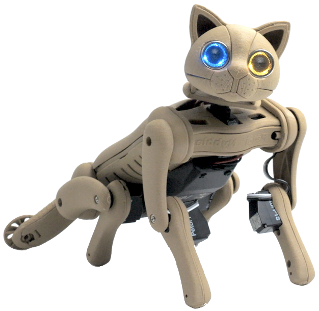

# Nybble Q User Manual

## Getting Started

Nybble Q is an open-source, voice-controlled robotic cat. It's a new breed of robotic cat that everyone can learn and play with.

<figure><figcaption></figcaption></figure>

The small but mighty Nybble Q has these fantastic features:

* Respond to voice commands, performing over **35 predefined actions** such as sit, push-up, and wash-face with high-performance, lifelike movements. You can switch between English and Chinese using simple voice commands.
* It can be programmed with **ten more customized voice commands** performing skills you create. The voice command can be any sound, so it's **free from languages**.
* Support **Petoi** **Coding Blocks(block-based Scratch-like), C++, and Python**.
* **Free** [C++](https://www.petoi.com/pages/free-cplusplus-quadruped-robotics-curriculum) and [Petoi Coding Blocks](https://www.petoi.com/pages/free-quadruped-robotics-curriculum-scratch-coding)(block-based Scratch-like) **curriculums**.
* Equipped with BiBoard V1, a high-performance **ESP32** development board supporting additional modules for robotics/AI/IoT applications.

If you have questions about _**why**_ rather than _**how**_, please post on our forum at [https://www.petoi.com/forum](https://www.petoi.com/forum) or write to [support@petoi.com](mailto:support@petoi.com).

There are some [supporting applications, software](https://docs.petoi.com/technical-support/supporting-application-and-software), and [FAQs](https://docs.petoi.com/technical-support/faq-frequently-asked-questions) for your reference.

You can support us by shopping at [www.petoi.com/store](https://bittle-x.petoi.com/www.petoi.com/store). Our social media (Instagram/Twitter/Facebook/GitHub) account is **@PetoiCamp**. Share your build by tagging **#nybbleQ #petoi #opencat** so we can repost it for you!


Last Updated: 11/12/2024

