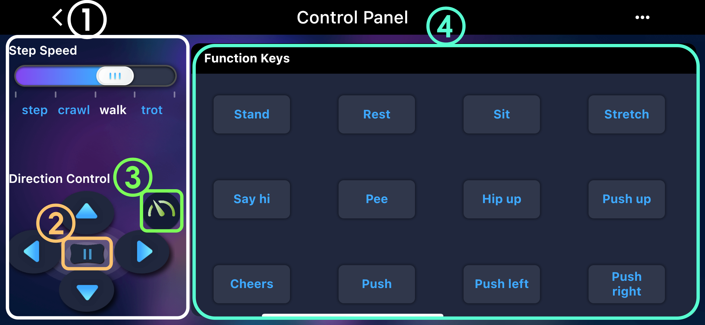
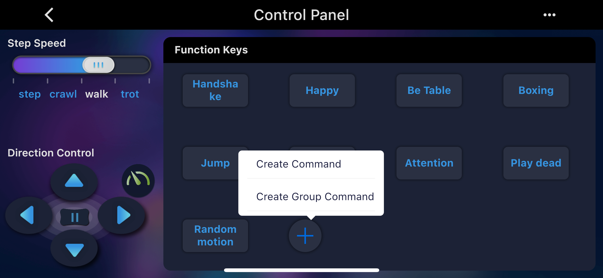
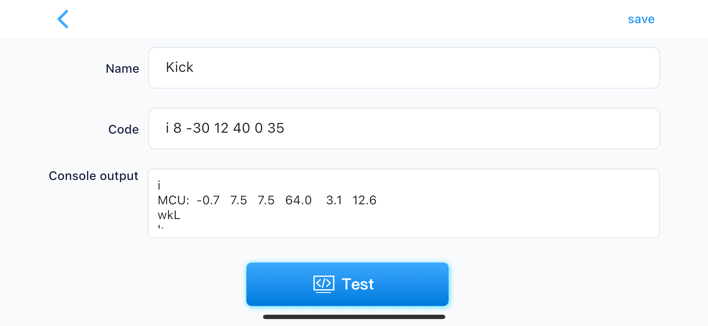
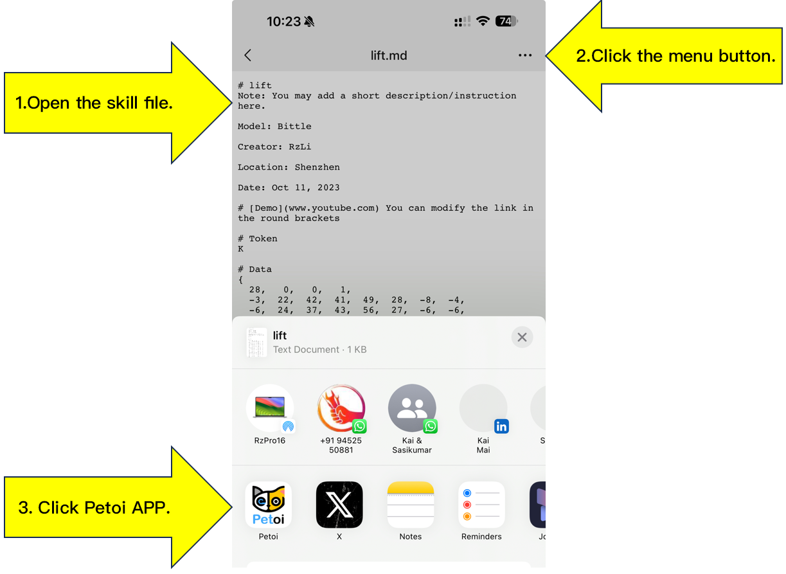
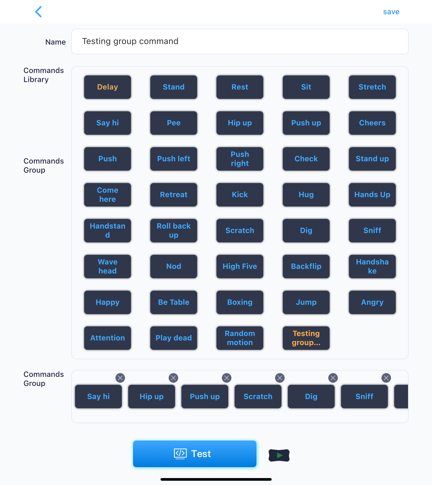

# Control Panel

In the control panel, you can control the robot to perform various poses, behaviors, and gaits.

<figure><figcaption></figcaption></figure>

## **Gaits** <a href="#bu-tai" id="bu-tai"></a>

①The left panel sets the gait and direction of the robotic pet and sends group commands, such as "walk left" or "trot forward." The robotic pet will only move after an initial gait and direction are selected.Selecting "Step" causes the pet to step in place.After choosing gaits like "Crawl," "Walk," or "Trot," clicking the "Backward" direction button followed by "Left" or "Right" will make the pet retreat diagonally left or right.

②The Pause button ("||") stops the pet’s motion and turns off all servos, allowing you to manually rotate joints to any angle.。

③“The "Accelerate" button（）accelerates the robot pet's movement. By default, it is off (green button with pointer left). Click to activate acceleration (orange button with pointer right). Acceleration is achieved by increasing the gyroscope frequency. When it is off, the robot reduces internal data calculations for faster and more stable movement.

## **Poses & Behaviors** <a href="#zi-shi-he-hang-wei" id="zi-shi-he-hang-wei"></a>

④Built-in poses and behaviors can be triggered by buttons in the "**Function Keys**" area. Avoid pressing buttons too frequently or repetitively. Allow time for the robot pet to complete its current action.

## **Custom Commands** <a href="#zi-ding-yi-ming-ling-dong-zuo" id="zi-ding-yi-ming-ling-dong-zuo"></a>

You can **long-press and drag** to reposition buttons.

**Double-click** command buttons to edit them.

Use the "+" button to add custom single or group commands.

<figure><figcaption></figcaption></figure>

### **Creating Single Command** <a href="#chuang-jian-dan-ge-ming-ling" id="chuang-jian-dan-ge-ming-ling"></a>

After clicking the "**Create Command**" button, you'll see the command editing interface:

<figure><figcaption></figcaption></figure>

In edit mode, a simplified serial command console appears (as shown above) for testing serial commands to control robot movements.

You can enter the following common serial commands in the **code** box:

**\* Rotate head (neck servo angle)**&#x20;

```
m0 45
```

**\* Shake head left/right (move joint 1 angle1, joint 2 angle2... angles: -127\~128)**

```
m0 -70 0 70
```

**\* Sit**

```
ksit
```

**\* Move joints sequentially**

```
m 0 -70 0 70 8 -30
```

**\* Move multiple joints simultaneously**

```
i 0 -45 8 -30 12 -60
```

For your reference, the images below are joint indexes. You can observe and try memorizing their patterns.

<figure><figcaption></figcaption></figure>

**\* Display current joint angles**

```
j
```

**\* Long "meow" (Nybble)**

```
u0 1
```

**\* Three short "meow"s**

```
u2 20
```

**\* Play short tone (buzzer duration: 0\~256)**

```
b12 100
```

**\*** Play melody (tone1 duration1, tone2 duration2... max 64 chars. Durations are reciprocal values, i.e., "note fractions" in musical notation)

```
b14 4 14 4 21 4 21 4
```

For detailed command specifications, please refer to the Serial Port Protocol<mark style="color:purple;">（注意这里要链接一下）</mark>section in the documentation center.

### Import New Skills as Custom Buttons <a href="#jiang-xin-ji-neng-dao-ru-wei-zi-ding-yi-an-niu" id="jiang-xin-ji-neng-dao-ru-wei-zi-ding-yi-an-niu"></a>

Import skills created locally on a computer (Skill Composer<mark style="color:purple;">（注意这里要链接一下）</mark>)

You can use communication software (e.g. WeChat) or email to send skill files created on your computer to your phone, and open the file using the Petoi app on your phone. This will automatically create a button for the new skill, open the Control Panel and you will see it.

<figure><figcaption></figcaption></figure>

**Import Skills from GitHub Skill Library**

The [SkillLibrary folder](https://github.com/PetoiCamp/OpenCat/tree/main/SkillLibrary) on GitHub contains a collection of new skills for OpenCat robots for your reference. Using your mobile browser, you can visit the GitHub page of the OpenCat project, open a skill file (e.g. [Bittle\_Fold.md](https://github.com/PetoiCamp/OpenCat/blob/main/SkillLibrary/Bittle/Bittle_Fold.md)), and share it to the Petoi mobile app as shown below. You can then execute this skill through command buttons.


On the iOS device, you may not share the .md skill file on the Github via the Chrome browser. You can download the skill file and refer to the method - [Import your local customized skill](https://docs.petoi.com/mobile-app/controller#import-your-local-customized-skill-created-by-the-skill-composer) to import it to this smartphone app.



You're also welcome to share your newly created skills by sending merge requests to [this folder](https://github.com/PetoiCamp/OpenCat/tree/main/SkillLibrary).

### Create Group Commands <a href="#chuang-jian-zu-he-ming-ling" id="chuang-jian-zu-he-ming-ling"></a>

After pressing the "Create Group Command" button, you'll see the following interface:

<figure><figcaption></figcaption></figure>

You can name the command group in the "**Name**" text box, and add commands to the "**Commands Group**" list by short pressing command buttons in the "**Commands Library**" list. In the **Commands Group** list, you can hold and drag the button of a single command to change its position.

Click the **Test** or **Play(****)** button to test execution of the group command. During execution, click the **Pause(** **)** button to interrupt the process.

Click the **Delete** button to remove the group command.

## Updates and Support <a href="#geng-xin-he-zhi-chi" id="geng-xin-he-zhi-chi"></a>

We will continue improving the app and notify you when updates become available. For any questions about the application, please write to [support@petoi.com](mailto:support@petoi.com).
