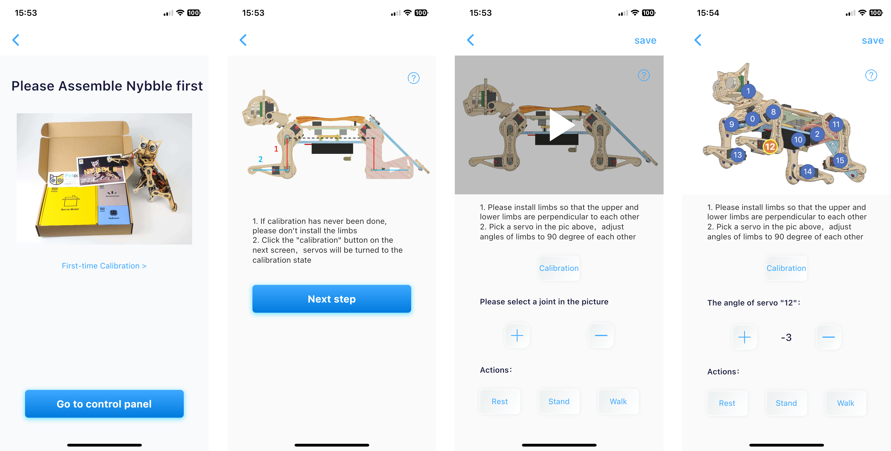
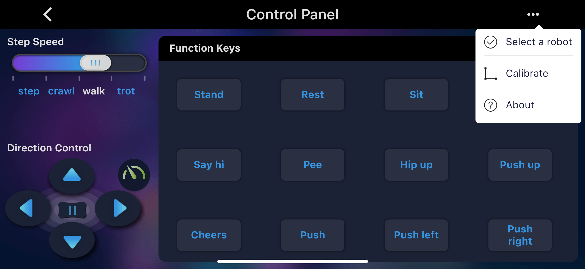

# Joint Calibration

Below is the display interface when you first use the app for calibration. We recommend placing the robot on the calibrator during this process.

## Nybble Q 

<figure><figcaption>
后面会改成新的
</figcaption></figure>


You can also reopen this calibration interface by clicking the menu icon in the upper-right corner of the control panel and selecting "**Calibrate**".



Upon entering the calibration interface, click the "Calibrate" button to immediately rotate all servo output shafts to their calibration positions.

<figure><figcaption></figcaption></figure>

First select the joint servo index number from the calibration interface image (when adjusting leg servos, adjust the thigh first followed by the calf). Then use the "+" or "-" buttons to fine-tune the joint to a right-angle position.


If calibration offset exceeds +/-9 degrees, remove the corresponding servo component, rotate it by one gear tooth position, reinstall it, then use the "+" or "-" buttons.

For example: If you need to use -10 as calibration value, remove the limb, rotate one gear tooth, then reinstall. The new calibration value should be around +4 (their absolute values sum to 14).

Note: Avoid rotating servo output shafts manually during adjustment.


You can test calibration results by switching between Rest/Stand/Walk statuses using the corresponding buttons.

图片】校准姿势、站立、休息姿势

<figure><figcaption></figcaption></figure>


Note: A second calibration round may be required for optimal results.


After completing calibration, remember to click "Save" to preserve calibration offsets. Or click "<" in the upper-left corner to discard changes.
