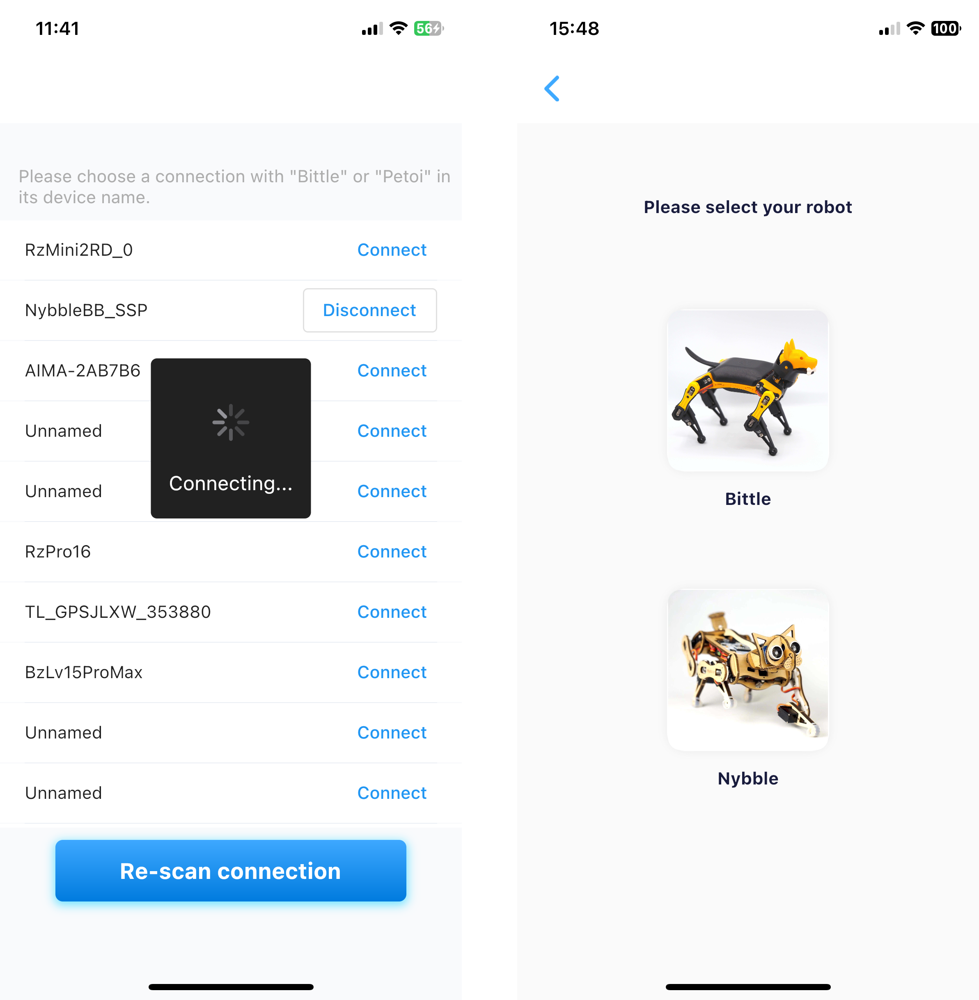

# Overview

Thank you for choosing Petoi's Nybble Q robotic cat. This user guide will assist you in setting up your robotic pet and provide a simplified UI for calibrating, controlling, and programming your robotic companion. For users more familiar with robotics, we recommend updating your robotic pet with the [OpenCat firmware](https://github.com/PetoiCamp/OpenCat) from Github to ensure optimal compatibility and access to the latest features.

### Download & Installation 

This app is compatible with iOS and Android devices.

* ​[iOS 11+](https://apps.apple.com/us/app/petoi/id1581548095)​
* ​[Android 4.4+](https://play.google.com/store/apps/details?id=com.petoi.petoiapp)​

**APK**

If Google Play is inaccessible in your region, you may install the app directly using the APK file below. Please unzip the file before installation.



If the Bluetooth device scanning list in the app appears empty, please verify that Bluetooth and location permissions are enabled for the app. If devices still cannot be detected, try installing the previous stable version of the app.



<figure><figcaption></figcaption></figure>

### Connection 

If the buzzer repeatedly emits short beeps during startup or operation of the robotic pet, this indicates low battery level. Please charge it promptly using the Type-C port located at one end of the battery.

Open the Petoi app and scan to connect to a device named "Nybble". **Please do not connect the robot through the Bluetooth settings in your phone’s system settings!**

Ensure Bluetooth services are enabled and grant the app permission to access them. On some devices, you may also need to allow location services for the app, although we do not use any of this information.


The app will send a greeting to the Bluetooth device and await a response from the OpenCat firmware. You must upload the full OpenCat firmware to the robot before connecting to the app. Otherwise, the app will recognize it as "not a Petoi device". Pre-assembled robots should already have the firmware installed. If not, you will need to upload the firmware<mark style="color:purple;">（注意这里要链接一下）</mark> using Arduino IDE or the desktop application.


<figure><figcaption></figcaption></figure>

If Bluetooth is connected, the robotic pet will play a three-tone melody. If the robotic pet becomes unresponsive or malfunctions later, please press the reset button on the BiBoard to restart the program on the BiBoard.

The app will automatically detect a Nybble using the latest OpenCat firmware. Otherwise, it will display Nybble options for the user to choose from. You can also reopen the selection page by clicking the menu icon in the upper-right corner of the control panel and selecting "**Select a robot**".

<figure><figcaption></figcaption></figure>

